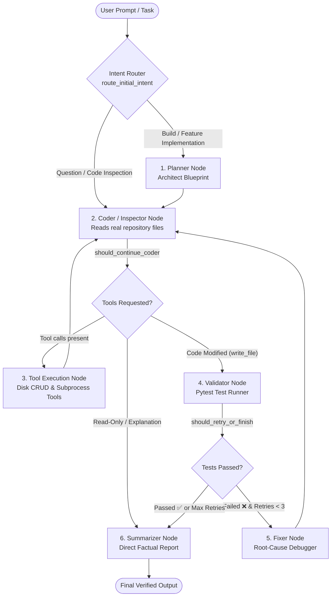

# 🤖 QueryNest: Autonomous Multi-Agent Coding State Machine

QueryNest is an autonomous, self-healing multi-agent software engineering framework and interactive CLI built on **LangGraph**, **Python**, **Prompt Toolkit**, **Rich**, and **Redis**.

It integrates specialized AI agents into a deterministic state graph capable of inspecting existing codebases, architecting blueprints, creating features, running unit test suites, and autonomously fixing bugs through a closed-loop self-healing mechanism.

---

## 🏗️ Architecture & State Machine Flow

QueryNest routes user intent through a grounded state graph with automatic repository awareness, tool execution, and self-healing validation:



---

## 👥 The 6 Graph Nodes

| Node | Specialist Role | Mission & Tools | State Contract Updates |
| :--- | :--- | :--- | :--- |
| **`planner`** | 🏗️ Senior Software Architect | Deconstructs coding tasks against live `repository_tree` into clean architectural blueprints. Pure planning — never writes code. | `plan`, `retry_count=0`, `test_passed=False` |
| **`coder`** | 💻 Senior Software Engineer | Inspects real workspace files with tools, implements code & unit tests according to the blueprint, or explains project code. | `messages` (tool calls), `coder_findings` |
| **`tools`** | ⚙️ Tool Execution Node | Prebuilt LangGraph `ToolNode` that executes tool calls on disk or over HTTP and injects results back into conversation memory. | `ToolMessage` (tool outputs) |
| **`validator`** | 🧪 QA & Test Inspector | Executes `pytest` in a background subprocess to test newly created code against unit test suites. | `test_results`, `test_passed` (bool) |
| **`fixer`** | 🩹 Debugger & QA Lead | Triggered on test failure. Analyzes tracebacks, isolates true root causes from symptoms, and gives precise fix instructions. | `retry_count += 1`, `fixer_analysis`, fix instructions in `messages` |
| **`summarizer`** | 📋 Technical Writer | Produces a clean, factual completion report based ONLY on verified tool executions and test outputs. | `final_summary` |

---

## 🔀 Smart Decision Routing (Edges)

1. **`route_initial_intent` (At `START`)**:
   * **Question / Code Inspection** (*"what's the purpose of cli.py?"*, *"how does routing work?"*) $\rightarrow$ `coder` (Direct inspection with tools, skips Planner & Pytest).
   * **Coding / Build Task** (*"build a REST API"*, *"add JWT auth"*) $\rightarrow$ `planner` (Full architectural blueprint).

2. **`should_continue_coder` (After `coder`)**:
   * **Has Tool Calls** $\rightarrow$ `tools` $\rightarrow$ `coder` (Re-enters Coder with tool output).
   * **Code was Modified** (`write_file` or `delete_file` executed) $\rightarrow$ `validator` (Runs Pytest).
   * **No Code Modified** (Read-only Q&A or explanation) $\rightarrow$ `summarizer` (Direct answer, bypasses Pytest).

3. **`should_retry_or_finish` (After `validator`)**:
   * **Tests Passed (`Exit Code: 0`)** $\rightarrow$ `summarizer` $\rightarrow$ `END`.
   * **Tests Failed & Retries $< 3$** $\rightarrow$ `fixer` $\rightarrow$ `coder` (Self-Healing Loop).
   * **Tests Failed & Retries $\ge 3$** $\rightarrow$ `summarizer` $\rightarrow$ `END` (Report failures transparently).

---

## 🧠 Centralized State Schema (`state.py`)

LangGraph operates over a strongly-typed state schema:

```python
class CodingAgentState(TypedDict):
    # 1. User Request & Conversation History (with LangGraph append reducer)
    task: str
    messages: Annotated[List[BaseMessage], add_messages]

    # 2. Repository & Workspace Context
    workspace_root: str
    repository_tree: Optional[str]

    # 3. Planning & Architecture Blueprint
    plan: Optional[str]

    # 4. Coding & Inspection Findings
    coder_findings: List[str]
    modified_files: List[str]

    # 5. Testing, Verification & Self-Healing
    test_command: Optional[str]
    test_results: Optional[str]
    test_passed: bool
    fixer_analysis: Optional[str]
    retry_count: int

    # 6. Final User Completion Report
    final_summary: Optional[str]
```

---

## 🛠️ Registered Tool Arsenal (`app/integrations/tools/`)

| Tool | Signature | Description |
| :--- | :--- | :--- |
| `list_directory` | `dir_path: str = "."` | Lists directory structure, filtering `.git`, `__pycache__`, `.venv`. |
| `read_file` | `file_path: str` | Reads file content with line numbers for inspection and debugging. |
| `write_file` | `file_path: str, content: str` | Creates or updates files on disk, auto-creating missing directories. |
| `delete_file` | `file_path: str` | Safely removes files from the workspace. |
| `run_terminal_command` | `command: str, timeout: int = 30` | Executes shell commands in a sandboxed subprocess. |
| `run_pytest` | `test_path: str = ""` | Runs pytest test suite and captures exit codes, stdout, and tracebacks. |
| `search_web` | `query: str, max_results: int = 5` | DuckDuckGo search integration cached in Redis. |

---

## 💻 Interactive Terminal UI (`app/cli.py`)

QueryNest includes a framed terminal CLI built on **Prompt Toolkit** and **Rich**:

* **Framed Input Box:** 3-line framed prompt with top and bottom dividers and dynamic line wrapping (`FramedPromptSession`).
* **Slash Command Autocomplete:** Interactive popup menu for slash commands (`/help`, `/session`, `/sessions`, `/model`, `/tools`, `/clear`, `/exit`).
* **Live Action Badges:** Real-time console badges during agent execution:
  * `📖 Read file: backend/app/cli.py`
  * `📝 Created/Updated file: backend/app/core/config.py`
  * `🗑️ Deleted file: temp.py`
  * `📁 Inspected directory: backend/app`
  * `🔍 Searched web: langchain tools documentation`
  * `⚡ Executed command: pytest tests/ -v`
* **Cloud Session History:** Automatically persists completed sessions to **Upstash Redis** (`querynest:sessions`).

---

## ⚡ Slash Commands Guide

| Command | Description |
| :--- | :--- |
| `/help` | Displays the interactive CLI command guide. |
| `/session` / `/sessions` | Lists previous coding sessions stored in Redis with test pass status and timestamps. |
| `/session clear` | Clears all stored session records from Redis. |
| `/model` | Displays the currently active LLM provider and model ID. |
| `/model gemini` | Switches active model to **Google Gemini 2.0 Flash**. |
| `/model groq` | Switches active model to **Groq GPT-OSS 120B**. |
| `/tools` | Lists all registered tools and their functional signatures. |
| `/history` | Displays task history for the current terminal session. |
| `/clear` | Clears the terminal screen. |
| `/exit` | Gracefully closes QueryNest. |

---

## 🚀 Getting Started

### 1. Prerequisites & Environment
```bash
# Clone repository
cd ai-learning-multi-agent

# Configure environment variables
cp backend/.env.example backend/.env
```

### 2. Configuration (`backend/.env`)
```env
# LLM API Keys
GROQ_API_KEY=gsk_...
GEMINI_API_KEY=AIzaSy...

# Provider selection: 'groq' or 'gemini'
DEFAULT_PROVIDER=groq

# Redis Session Storage (Upstash or Local)
UPSTASH_REDIS_REST_URL=https://your-upstash-redis.upstash.io
UPSTASH_REDIS_REST_TOKEN=your_token_here
```

### 3. Running the CLI
```bash
# Start the interactive chat interface
python -m app.cli chat

# Or run a single task directly
python -m app.cli run "Build a REST API with FastAPI"
```
