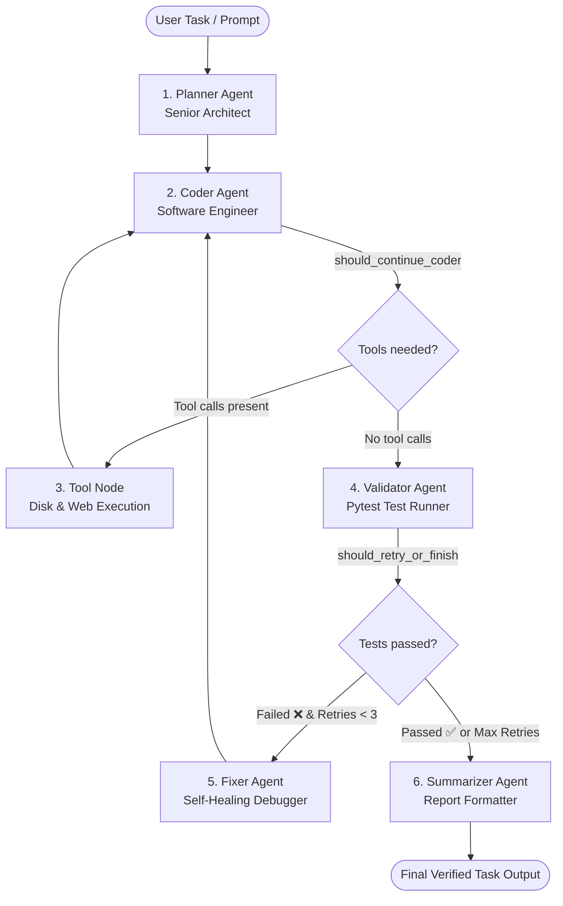

# 🤖 Autonomous Multi-Agent Coding Workflow (LangGraph)

An autonomous, self-healing multi-agent coding system built with **LangGraph**, **Python**, and free LLM providers (**Groq** / **Google Gemini**).

---

## 🏗️ Architecture & State Machine Flow

The system operates as a state graph with specialized specialist agents, automated tool execution, and an autonomous **self-healing debugging loop**:



---

## 👥 The 6 Specialized Graph Nodes

| Node | Role / Responsibility | Tools Available | Output / State Update |
| :--- | :--- | :--- | :--- |
| **`planner`** | Analyzes the task, explores files, and designs a step-by-step blueprint with target files and test files. | `list_directory`, `read_file` | `plan`, `retry_count=0` |
| **`coder`** | Implements the architecture by generating code and unit tests. Emits tool calls to create or modify files. | `write_file`, `read_file`, `list_directory`, `search_web` | `messages` (with `tool_calls`) |
| **`tools`** | Prebuilt LangGraph `ToolNode` that physically executes tool calls on your disk or fetches web results. | All registered Python tools | `ToolMessage` (tool results) |
| **`validator`** | Executes `pytest` in a background subprocess to test the new code. | `run_pytest`, `run_terminal_command` | `test_results`, `test_passed` (bool) |
| **`fixer`** | Analyzes pytest error tracebacks, diagnoses the root cause, and provides exact fix instructions to the Coder. | None (Pure Reasoning) | `retry_count += 1`, fix instructions |
| **`summarizer`** | Formats the final user-facing report (features implemented, files modified, test verification proof). | None (Documentation) | `final_summary` |

---

## 🔀 The 2 Conditional Decision Points (Edges)

1. **`should_continue_coder` (Tool Execution Loop)**:
   - If the Coder LLM emits `tool_calls` $\rightarrow$ routes to `tools` and loops back to `coder`.
   - If no tool calls $\rightarrow$ the Coder is done writing files; routes to `validator`.

2. **`should_retry_or_finish` (Self-Healing Loop)**:
   - If `test_passed == True` $\rightarrow$ routes to `summarizer` (Task Complete!).
   - If `retry_count >= 3` $\rightarrow$ routes to `summarizer` (Reached retry limit).
   - If tests failed $\rightarrow$ routes to `fixer` (Diagnose bug and loop back to `coder`).

---

## 🛠️ Dynamic Tool Arsenal (`app/integrations/tools/`)

All tools are standard Python functions decorated with `@tool` and decoupled from hardcoded prompt text:

### 1. Filesystem Tools (`file_tools.py`)
* **`list_directory(dir_path)`**: Lists workspace files, filtering out `.git`, `__pycache__`, `.venv`.
* **`read_file(file_path)`**: Reads code safely with line numbers for easy debugging.
* **`write_file(file_path, content)`**: Creates or updates files, auto-creating missing parent directories.
* **`delete_file(file_path)`**: Safely removes files.

### 2. Terminal & Sandbox Tools (`terminal_tools.py`)
* **`run_terminal_command(command)`**: Spawns a background `subprocess` to run commands with a 30s timeout and safety keyword filters.
* **`run_pytest(test_path)`**: Executes `pytest -v` and captures stdout, stderr, and exit codes.

### 3. Web Knowledge Tools (`web_tools.py`)
* **`search_web(query)`**: DuckDuckGo search integration for live documentation and syntax lookups without API keys.

---

## 🧠 State Schema (`app/modules/coding_agent/state.py`)

LangGraph uses a Redux-like centralized state:

```python
class CodingAgentState(TypedDict):
    messages: Annotated[List[BaseMessage], add_messages]  # Auto-appending reducer
    task: str                                            # User prompt
    plan: Optional[str]                                  # Architect plan
    modified_files: List[str]                            # Files created/edited
    test_command: Optional[str]                          # Target test path
    test_results: Optional[str]                          # Pytest stdout/stderr
    test_passed: bool                                    # Boolean test flag
    retry_count: int                                     # Self-healing attempt count
    final_summary: Optional[str]                         # Final Markdown report
```

---

## 📁 Project Structure

```text
ai-learning-multi-agent/
├── README.md                         # Project documentation
├── agents.md                         # Agent reference guide
│
├── backend/
│   ├── .env                          # GROQ_API_KEY / GEMINI_API_KEY
│   ├── requirements.txt              # Dependencies (langgraph, langchain-groq, etc.)
│   └── app/
│       ├── main.py                   # FastAPI server entrypoint
│       │
│       ├── core/
│       │   ├── config.py             # Pydantic Settings & environment variables
│       │   └── llm.py                # Free LLM factory (Groq LLaMA-3.3-70B / Gemini-2.0-Flash)
│       │
│       ├── integrations/tools/       # Reusable Tools
│       │   ├── __init__.py           # ALL_TOOLS export bundle
│       │   ├── file_tools.py         # File CRUD operations
│       │   ├── terminal_tools.py     # Subprocess command & pytest runner
│       │   └── web_tools.py          # DuckDuckGo search
│       │
│       └── modules/coding_agent/     # Coding Agent Workflow Module
│           ├── __init__.py
│           ├── state.py              # CodingAgentState definition
│           ├── prompts.py            # Decoupled agent system prompts
│           ├── nodes.py              # 6 graph node functions
│           ├── edges.py              # 2 conditional routing functions
│           └── graph.py              # Assembled & compiled StateGraph
│
└── frontend/                         # Frontend UI (optional future extension)
```

---

## 🚀 Key Advantages of This Architecture

1. **Zero-Cost LLM Inference:** Built to work out of the box with generous free tiers from **Groq** (`llama-3.3-70b-versatile`) and **Google AI Studio** (`gemini-2.0-flash`).
2. **True Autonomy:** The model writes real files to disk and runs real tests in your terminal.
3. **Self-Healing:** Code errors are caught by pytest and fixed automatically without human intervention.
4. **Decoupled & Modular:** Adding new tools or agents takes only a few lines without rewriting prompts or graph logic.
